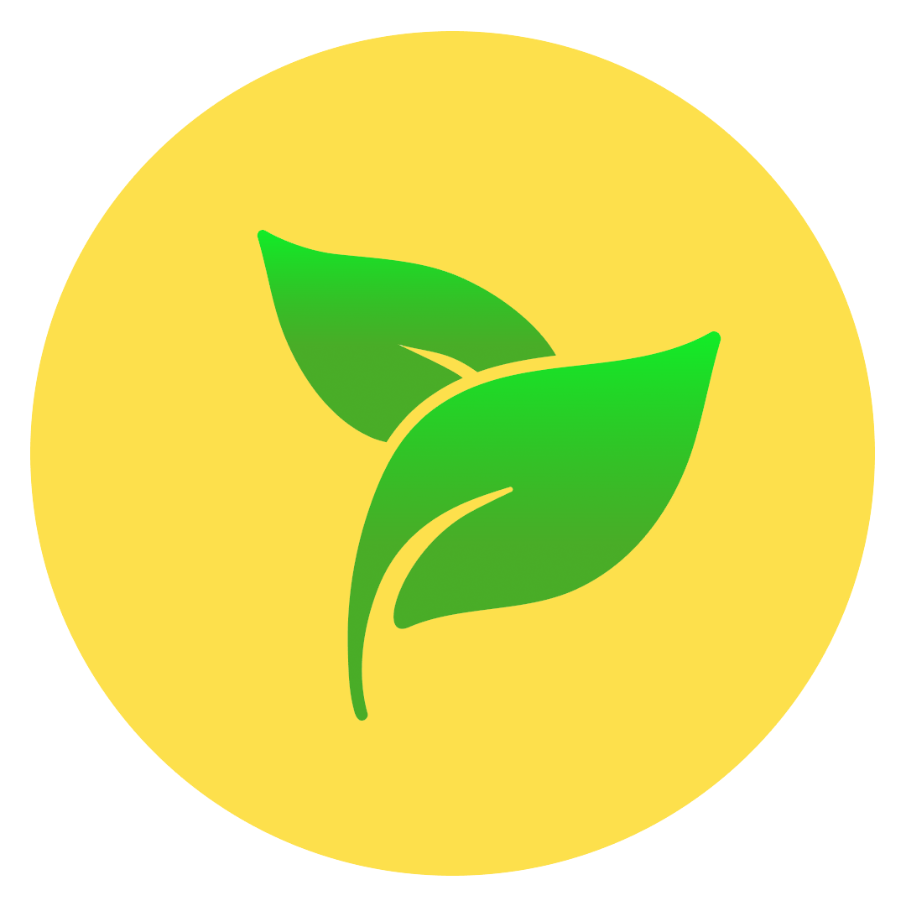

# Smart Gardening

  

Smart Gardening is a Android application that can help you to get more information about plant in just one tap.

This project created to accomplish [Bangkit 2021](https://grow.google/intl/id_id/bangkit/) Capstone Project

## :gear: Built With

### :iphone: Android

- [Kotlin](https://kotlinlang.org/)

### :robot: Machine Learning

- [Jupyter Notebook](https://jupyter.org/)
- [Tensorflow](https://www.tensorflow.org/)

### :cloud: Cloud

- [Gin](https://github.com/gin-gonic/gin) - Go
- [Flask](https://flask.palletsprojects.com/en/2.0.x/) - Python
- [Google Cloud Platform](https://cloud.google.com/)
  - [Cloud Build](https://cloud.google.com/build) (Continous Deployment)
  - [Cloud Run](https://cloud.google.com/run) (Gin REST API)
  - [Cloud Storage](https://cloud.google.com/storage) (Image Store)
  - [Compute Engine](https://cloud.google.com/compute) (Flask Prediction API)
  - [Container Registry](https://cloud.google.com/container-registry) (Docker Images)
  - [Firestore](https://cloud.google.com/firestore) (Database)
  - [Secret Manager](https://cloud.google.com/secret-manager) (Store API Key)

## :eyes: Replicate

- :iphone: Android
  - [README-Android.md](README-Android.md)
- :robot: Machine Learning
  - [README-Machine-Learning.md](README-Machine-Learning.md)
- :cloud: Cloud
  - [README-Cloud.md](README-Cloud.md)

For detail information please check README-[PATH].md above

## :scroll: License

Distributed under the MIT License. See `LICENSE` for more information.
